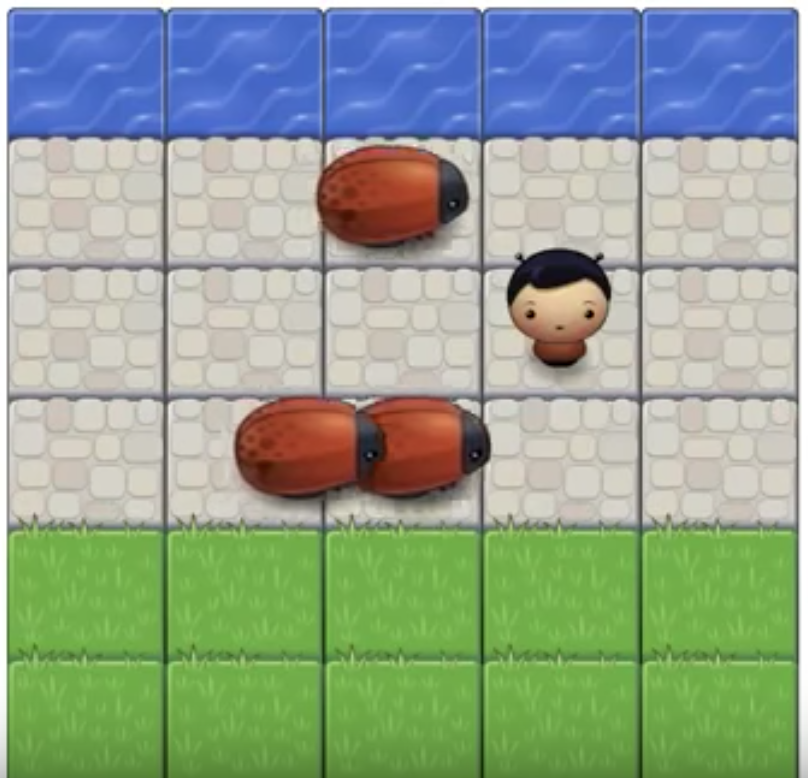

# Classic Arcade Game - Frogger on a Website
Udacity Front End Developer - Project 3: Arcade Game - Frogger

This is the Project 3 for the Udacity Front End Web Developer Nanodegree. In this I developed the javascript code to create the functionality of the popular Arcade game. The game consists of a game board with image tiles on which three enemies move from left to right. The player starts at the bottom middle of the game board and the goal is to reach the top of the game board without colliding with the enemies moving on the game board. The player movement is controlled by the left, right, up and down arrow keys.

The starter code provided by Udacity contains visual assets and a game loop engine; using these tools I added a number of entities to the game including the player characters and enemies to recreate the classic arcade game Frogger.

JavaScript’s object oriented programming features were used to write eloquently designed classes capable of creating countless instances of similarly functioning objects. Inheritance and delegation can be used to create well architected and performant application.

## Overview: Game Functionality

In this game we have a Player and Enemies (bugs). The goal of the player is to reach the water, without colliding into any one of the enemies.

* The player can move left, right, up and down
* The enemies move at varying speeds on the paved block portion of the game board
* Once a the player collides with an enemy, the game is reset and the player moves back to the starting square
* Once the player reaches the water (i.e., the top of the game board), the game is won

Below is an image of the game board.

## Code Information

The javascript files are located in the /js/ folder. There are three .js files:
* app.js
* engine.js
* resources.js

The engine.js and resources.js files were provided by Udacity.

app.js file is where most my code is located. 

In app.js I created the classes Enemy and Player. Then I added all the properties and functions to make the game.

See the comments in all the three .js files for detailed information on how the various variables and functions work.

We also have the index.html file which takes care of the basic html of the game. This was provided by Udacity as well with starter code.

I added the html for creating the modal required to display the window when the game is won by the player.

Also in the /css/ folder the style.css file has all the styling related to the index.html file.
I added the styling needed to display the modal.

## Running the game on your computer
To run the game clone the repository to your local folder. All the folders and sub folders will be needed to run the game. Once downloaded, open a web browser and open the index.html file to play the game.
